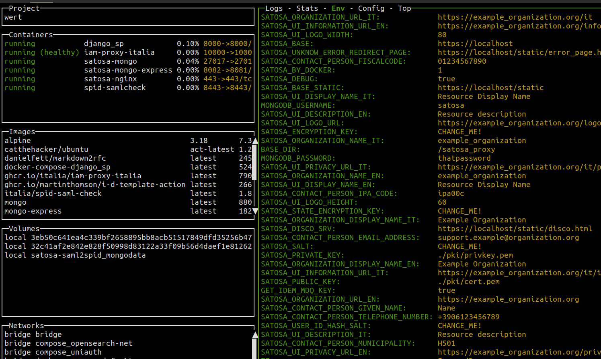
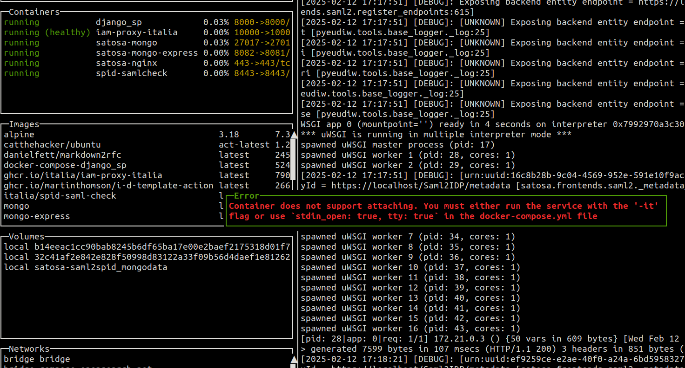

# Developing a Python package for this project

This document contains a smart approach about how to develop or modify a Python library that uses the current project Docker as a test or develop environment.
For example, those instructions can be used to create a developer environment for further development of [eudi-wallet-it-python](https://github.com/italia/eudi-wallet-it-python).
The instructions below are intended to be a suggestion or a guideline rather than a standard.

## Step 0: Identify which Python dependency requires development

We assume that the developer needs to develop a modified version of the library [eudi-wallet-it-python](https://github.com/italia/eudi-wallet-it-python) which is a dependency of the container `iam-proxy-italia`.
A local copy of the library is required.
We assume that the project eudi-wallet-it-python has been cloned in the folder `/home/username/my/development/folder/eudi-wallet-it-python/pyeudiw`. The path prefix `/home/username/my/development/folder/` is an example and should be replaced here with the location of your own development package.

## Step 1: Set environment variable

Set the environment variable `SATOSA_DEBUG=true`. This can be done either in the terminal with the command `export SATOSA_DEBUG=true`, or by updating the file [.env](Docker-compose/.env) by appending the entry `SATOSA_DEBUG=true`.

## Step 2: Update the docker volume by binding the local development directory

In the file [docker-compose.yml](Docker-example/docker-compose.yml), among the volumes of the container `iam-proxy-italia`, add the entry
    
    volumes:
        - /home/username/my/development/folder/eudi-wallet-it-python/pyeudiw:/.venv/lib/python3.12/site-packages/pyeudiw:rw

Please note that `python3.12/` may vary depending new versions of the project. 
This will replace the installed dependency package with your own local code.

**NOTE:** at the time of writing, container volume is binded to the location `/.venv/lib/python3.12/site-packages`, but your location might be different as it always reference the Python version that is awailable in the container, which in this case is `Python3.12`. Check che actual python version of your container before completing with this step.

## Step 3: Run the container

Launch the script [run-docker-compose.sh](Docker-compose/run-docker-compose.sh). This will launch the docker composition that includes the container `iam-proxy-italia`.

## Step 4 (Optional): Install further dependencies in the container

If your version of the library contains further dependencies, or if you want to install development only dependencies such as, say [pdbpp](https://github.com/pdbpp/pdbpp), you can create a new image that contains the required dependency or execute a terminal (such as a `bash`) within the container and install it manually, therefore commit the changes to the docker container, as shown in the next section.
Two different options are presented, based on your preferences or requirements.

### Option 4.1: Add the dependency to an existing container

The following steps instructs on how to install a new pip dependency to an existing container. We will assume that the container has name `iam-proxy-italia`.

1. Enter in the container environment with `docker exec -it iam-proxy-italia bash`. Note that to perform the `docker exec` command, the container MUST be running.
2. Execute the following commands to install you own dependencies; replace `new_package_name` with the new dependency

````
    source /.venv/bin/activate
    pip3 install new_package_name
````

3. Exit from the container area with Docker escape control sequence, that is, `Ctrl+P` followed by `Ctrl+Q`.
4. Freeze the changes with the command `docker container commit iam-proxy-italia`.
5. Stop and then restart the container.

At the end of the procedure, you will find the required dependency as part of your container.

### Option 4.2: mount a volume containing your dev package

Instead of installing by hand a new package and commit the change on the container,
you can stop the container, mount the path of your package and restart the container.

This enables fast updates to your code, that would only require the respawn of the uwsgi process:

  - restart iam-proxy-italia container
  - respawn process by touching the uwsgi respawn file (/satosa_proxy/proxy_conf.yaml) through an attached shell

This can be easily achieved by doing a configuration like the one below,
in the documer compose section about the container iam-proxy-italia

````
    volumes:
      - ./satosa-project:/satosa_proxy:rwx
      - /home/User/Dev/eudi-wallet-it-python/pyeudiw:/.venv/lib/python3.12/site-packages/pyeudiw:rwx
````

If you might not see the changes in realtime, you shoud `down` the compose and do an `up`.

````
docker compose down
# ...
docker compose up
````

### Option 4.3: Create a new image Dockerfile

The following steps instruct on how to create a new image with the new required python dependency. This new image will be the base of the updated container.

1. Stop the container `iam-proxy-italia` with the command `docker stop iam-proxy-italia`.
2. Create a new folder.
3. Inside the new folder, create a Dockerfile with the following content, replacing `new_package_name` with the target package:

        FROM ghcr.io/italia/iam-proxy-italia:latest
        RUN source /.venv/bin/activate && pip3 install new_package_name

4. Build the new image: `docker build . -t iam-proxy-italia`.
5. Modify docker-compose.yml to replace the old image reference with `iam-proxy-italia`.
6. Re-run `docker compose up`.

**NOTE:** if the image is already built locally, you can simply update the existing Dockerfile instead of creating a new one from scratch.

## Step 5 (Optional): Insert a breakpoint to check that your setting is working as intended

1. set the ENV var SATOSA_DEBUG: `export SATOSA_DEBUG=true`
2. execute the compose having mounted your package folder as volume (eg: eudi-wallet-it-python)
3. Add the line `breakpoint()` to a file of your package that requires investigation.
4. restart the iam-proxy-italia container (`docker stop iam-proxy-italia && docker start iam-proxy-italia`.) or touch the uwsgi reload file within the running container: `touch /satosa_proxy/proxy_conf.yaml`

If everything worked as intended, the program execution should stop at the given `breakpoint()`.
To further investigate the state of the program at the time it was stopped,
you can use the command `docker attach iam-proxy-italia` in a new terminal.


### SATOSA_DEBUG true

By setting the ENV variable `SATOSA_DEBUG` to `true` you may be able to evaluate the ENV variables in the docker container and check
that your configuration was succesfully applied, as shown in the picture below.



`SATOSA_DEBUG=true` makes iam-proxy-italia be executed with a debug configuration of uwsgi.

If you don't have configured it in debug mode, you will not be able to attach to the stdin of the executed
container, as shown in the picture below.




### Reload iam-proxy-italia using UWSGI

With the command `touch iam-proxy-italia/Docker-compose/satosa-project/proxy_conf.yaml` you will be able to
restart iam-proxy-italia internal uwsgi command without restarting the entire container. This will save a lot of time
for your debug scopes.
